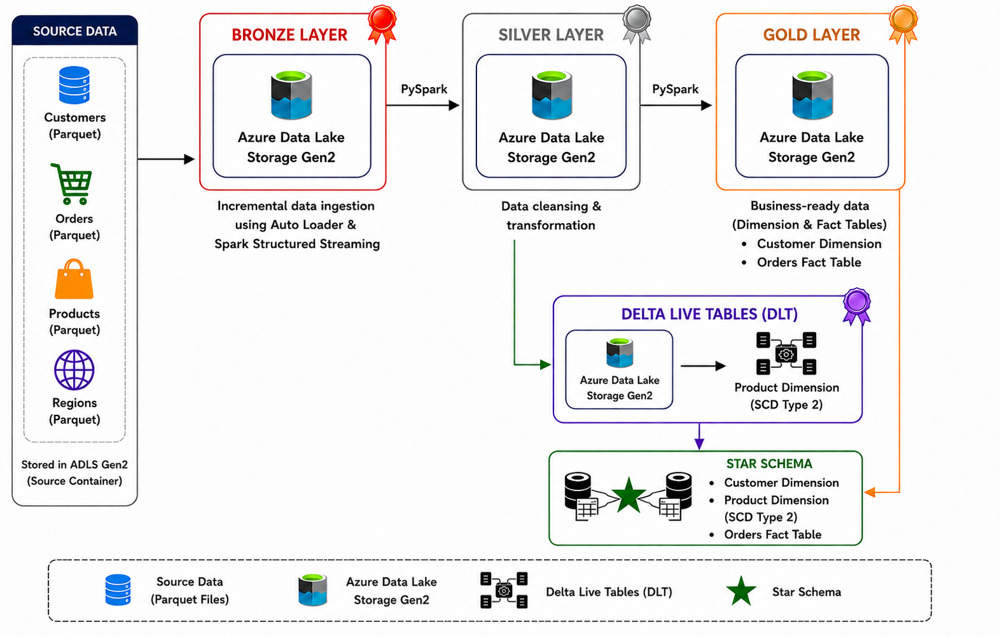
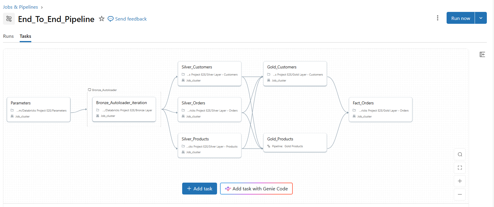
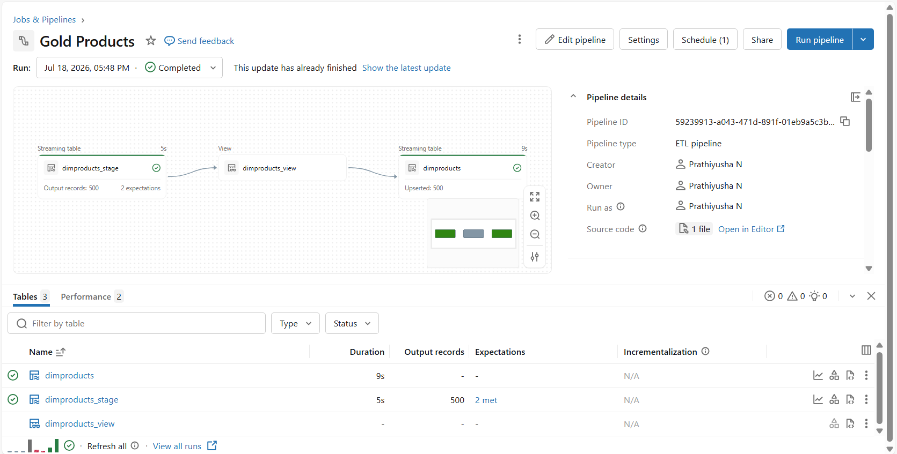
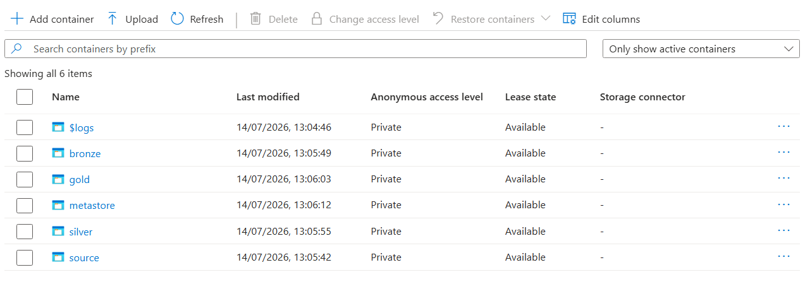
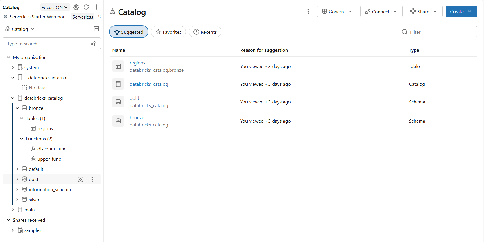
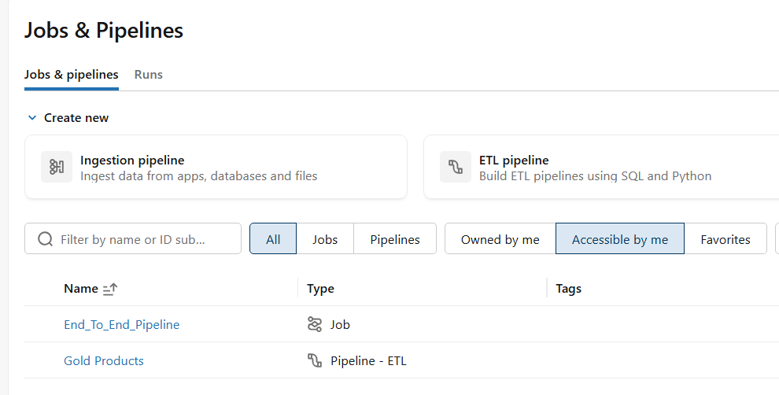

# Azure Databricks End-to-End Data Engineering Project

## 📖 Project Overview

This project demonstrates an end-to-end Data Engineering pipeline on Azure Databricks using the Medallion Architecture (Bronze, Silver, and Gold). Customer, Orders, and Product source data stored in Azure Data Lake Storage Gen2 (ADLS Gen2) is ingested incrementally using Databricks Auto Loader and Spark Structured Streaming, then transformed through multiple layers using PySpark.

The Silver layer performs data cleansing and business transformations using PySpark and includes a Python OOP class for practising window-function-based ranking logic. In the Gold layer, Customer Dimension upsert logic is implemented using PySpark and Delta Lake MERGE, with surrogate key generation. The Product Dimension is configured using Delta Live Tables (DLT) with SCD Type 2 change-processing logic and data quality expectations. An Orders Fact table joins Customer and Product dimension data to demonstrate a basic Star Schema. A Databricks Workflow was built to orchestrate the main Customer, Orders, and Product pipeline, including a parameterized for-each task for Bronze ingestion.

---

## 🛠️ Tech Stack

| Technology | Description |
|------------|-------------|
| Microsoft Azure | Cloud platform used to host the data engineering solution. |
| Azure Data Lake Storage Gen2 (ADLS Gen2) | Stores the source, Bronze, Silver and Gold datasets. |
| Azure Databricks | Main platform used to build and run the data pipeline. |
| PySpark | Used to perform data ingestion, cleansing and transformations. |
| Spark Structured Streaming | Enables incremental file ingestion through Databricks Auto Loader. |
| Databricks Auto Loader | Automatically ingests new Parquet files into the Bronze layer. |
| Delta Lake (MERGE) | Implements SCD Type 1 upserts for the Customer Dimension. |
| Delta Live Tables (DLT) | Configures SCD Type 2 change-processing logic for the Product Dimension. |
| Unity Catalog | Governs Bronze/Silver/Gold tables through a catalog.schema.table namespace. |
| Databricks Workflows | Job built to orchestrate the main Customer, Orders, and Product pipeline using task dependencies and a for-each loop. |

---

## 🏗️ Architecture Diagram

  

<em>Auto Loader / Spark Structured Streaming ingestion applies to the Customers, Orders, and Products source files; the Regions dataset was loaded into Bronze separately.</em>

---

## 🚀 Pipeline

  

<em>Databricks Workflow (Job) showing task dependencies across the main Customer, Orders, and Product pipeline, including a parameterized for-each loop for Bronze ingestion.</em>

---

## 🚀 Gold Products Pipeline

  

<em>Delta Live Tables pipeline run for the Product Dimension (SCD Type 2).</em>

---

## 🖥️ Environment Setup

  

<em>ADLS Gen2 storage account with source, bronze, silver, gold, and metastore containers.</em>

  

<em>Unity Catalog structure showing the bronze, silver, and gold schemas registered under databricks_catalog.</em>

  

<em>The End_To_End_Pipeline job and Gold Products DLT pipeline configured in Databricks Workflows.</em>

---

## 🔄 Project Workflow

### Bronze Layer
- Ingested Customer, Orders, and Product source data from ADLS Gen2 using Databricks Auto Loader.
- Used Spark Structured Streaming for incremental file ingestion.
- Stored ingested raw data in Parquet format in the Bronze layer.
- The Regions dataset was loaded into the Bronze layer separately, outside the Auto Loader loop used for the other three datasets.

### Silver Layer
- Performed data cleansing and business transformations using PySpark.
- Applied data type conversions and derived business columns.
- Registered custom Unity Catalog SQL and Python functions (`discount_func`, `upper_func`). The discount function was applied in the Products PySpark transformation, while the uppercase function was demonstrated through a SQL query.
- Practiced PySpark window functions (dense_rank, rank, row_number) using a Python OOP class in the Orders notebook, as a ranking-logic exercise — this output is not part of the final persisted Silver or Gold tables.
- Stored transformed data as Delta tables.
- The Regions dataset is also ingested and prepared as a Silver reference table but is not currently used in the Gold Star Schema.

### Gold Layer
- Implemented Customer Dimension upsert logic using PySpark and Delta Lake MERGE, with surrogate key generation.
- Configured Delta Live Tables with SCD Type 2 change-processing logic and data quality expectations for the Product Dimension.
- Created an Orders Fact table by joining Customer and Product dimension data.
- Demonstrated a basic Star Schema consisting of Customer and Product dimensions with an Orders Fact table.

---

## 📚 Learnings

- Medallion Architecture
- Databricks Auto Loader
- Spark Structured Streaming
- PySpark Transformations
- SCD Type 1 using Delta Lake Merge
- SCD Type 2 using Delta Live Tables
- Unity Catalog
- Databricks Workflows
- Star Schema Design
